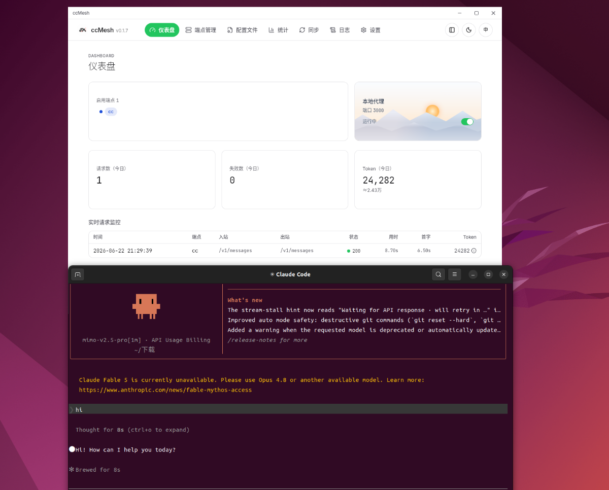

<div align="center">
  
  <h1>ccMesh</h1>

  <p><strong>A lightweight cross-platform AI proxy gateway desktop app.</strong></p>

  <p>
    
    
    <a href="https://github.com/VkRainB/ccMesh/releases"></a>
    <a href="https://github.com/VkRainB/ccMesh/stargazers"></a>
  </p>
  <p>
    
    
    
  </p>

  <p>
    <a href="https://github.com/VkRainB/ccMesh">GitHub</a>
    ·
    <a href="https://github.com/VkRainB/ccMesh/releases/latest">Download</a>
    ·
    <a href="docs/guides/auto-update-and-release.md">Updates & Release</a>
    ·
    <a href="README.md">中文</a>
  </p>
</div>

---

ccMesh is a desktop AI proxy gateway built with **Tauri 2 + Rust + React 19**. It unifies access to Claude, OpenAI, Codex, and other upstream providers on your machine, with protocol transformation, model mapping, endpoint rotation and circuit breaking, request analytics, and configuration management. Available on Windows, macOS, and Linux.

## Screenshots

<table>
  <tr>
    <td align="center"><br/><sub>Dashboard: proxy status, token overview, live request monitor</sub></td>
    <td align="center"><br/><sub>Endpoints: multi-endpoint management, model mapping, connectivity tests</sub></td>
  </tr>
  <tr>
    <td align="center"><br/><sub>Config Profiles: Claude Code / Codex channel management</sub></td>
    <td align="center"><br/><sub>Statistics: usage summaries and per-endpoint breakdowns</sub></td>
  </tr>
  <tr>
    <td align="center"><br/><sub>Sync: backup, restore, and export</sub></td>
    <td align="center"><br/><sub>Settings: global proxy, UA, and system options</sub></td>
  </tr>
  <tr>
    <td colspan="2" align="center"><br/><sub>Dark theme UI</sub></td>
  </tr>
</table>

## Features

### Dashboard

- Start/stop the local proxy and view port status at a glance
- Today's token usage and request overview
- Live request monitor: model, duration, time-to-first-byte, token details

### Endpoints

- Multi-endpoint CRUD, drag-and-drop ordering, list/grid views
- Three transformers: **claude (passthrough)**, **openai (transform)**, **codex (Responses)**
- Model catalog, inbound/outbound model mapping, connectivity testing
- Model-aware rotation and circuit breaking to avoid unrelated endpoint failures

### Config Profiles

- Manage Claude Code `settings.json` and Codex `auth.json` + `config.toml` as channels
- Endpoint write / custom write modes with two-way form ↔ JSON sync
- Separate save vs. apply; automatic backup before overwriting live configs

### Statistics & Sync

- Historical usage by app, endpoint, and model
- Configuration and data backup, restore, and export

### Settings

- Global outbound proxy, Claude/Codex CLI User-Agent
- In-app auto-update via GitHub Releases

## Install

Latest installers are on [Releases](https://github.com/VkRainB/ccMesh/releases/latest). The built-in updater pulls new versions from GitHub (see [`docs/guides/auto-update-and-release.md`](docs/guides/auto-update-and-release.md)).

### Windows

Download `*-setup.exe` (NSIS) or `*.msi` and run the installer.

### macOS (currently unsigned)

Without Apple Developer signing and notarization, Gatekeeper may block the app on first launch. Recommended:

1. Drag ccMesh.app into Applications
2. **Right-click** ccMesh → **Open** → confirm **Open** again

If you see "damaged" errors, run in Terminal:

```bash
xattr -dr com.apple.quarantine /Applications/ccMesh.app
```

### Linux

Choose a package for your distro:

- **AppImage (recommended)**

  ```bash
  chmod +x ccMesh_*.AppImage
  ./ccMesh_*.AppImage
  ```

- **deb (Debian/Ubuntu)**

  ```bash
  sudo apt install ./ccMesh_*_amd64.deb
  ```

- **rpm (Fedora/RHEL)**

  ```bash
  sudo dnf install ./ccMesh-*.x86_64.rpm
  ```

<div align="center">
  <br/><sub>ccMesh running on Linux desktop</sub>
</div>

## Build from source

**Prerequisites**

- Rust stable — https://rustup.rs
- Node.js LTS, pnpm 10+
- Tauri prerequisites for your platform — https://tauri.app/start/prerequisites/

**Development**

```bash
pnpm install
pnpm tauri dev      # start desktop dev environment
pnpm test           # frontend unit tests
```

**Production build**

```bash
pnpm tauri build
```

Platform-specific build deps:

- **Windows**: MSVC toolchain + WebView2
- **macOS**: Xcode Command Line Tools (universal binary)
- **Linux** (Ubuntu/Debian build host):

  ```bash
  sudo apt-get install -y \
    libwebkit2gtk-4.1-dev \
    libayatana-appindicator3-dev \
    librsvg2-dev \
    patchelf
  ```

> If updater signing artifacts are enabled, local `pnpm tauri build` requires `TAURI_SIGNING_PRIVATE_KEY` and related env vars. See [`docs/guides/auto-update-and-release.md`](docs/guides/auto-update-and-release.md).

**Checks**

```bash
pnpm check:front
pnpm check:rust
```

## Tech stack

Tauri 2, Rust, axum, reqwest (rustls), SQLite, React 19, TypeScript, Vite, TanStack Query, Tailwind CSS v4, shadcn/ui, CodeMirror 6.

## License

ccMesh is licensed under the [Apache License 2.0](LICENSE).

## Star History

<div align="center">
  <a href="https://www.star-history.com/#VkRainB/ccMesh&Date">
    <picture>
      <source media="(prefers-color-scheme: dark)" srcset="https://api.star-history.com/svg?repos=VkRainB/ccMesh&type=Date&theme=dark" />
      <source media="(prefers-color-scheme: light)" srcset="https://api.star-history.com/svg?repos=VkRainB/ccMesh&type=Date" />
      
    </picture>
  </a>
</div>
