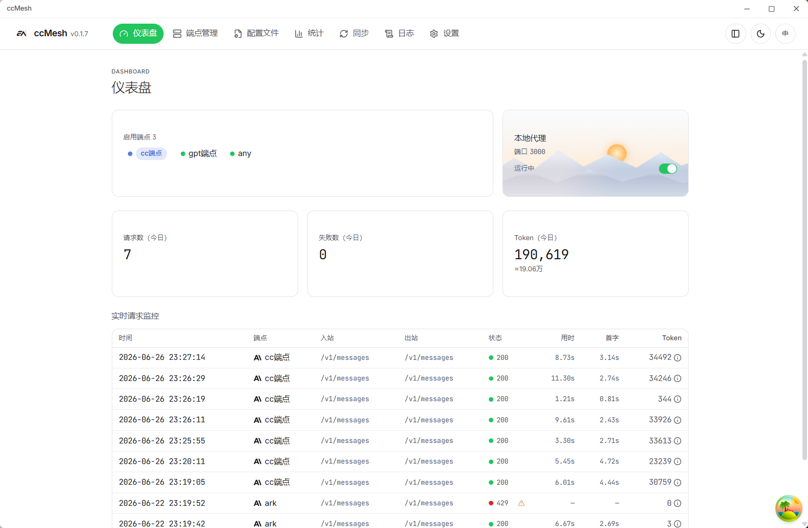
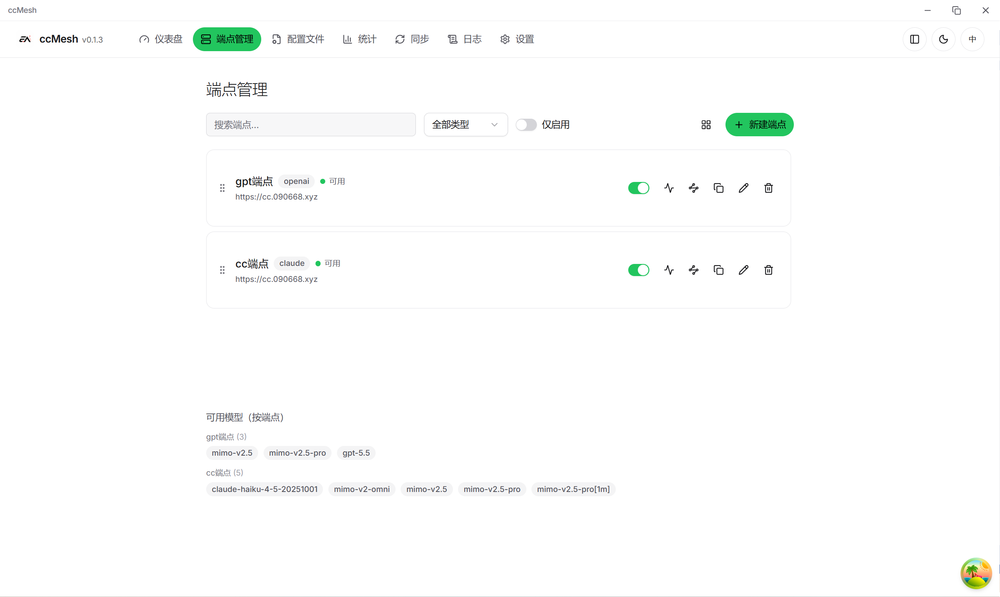
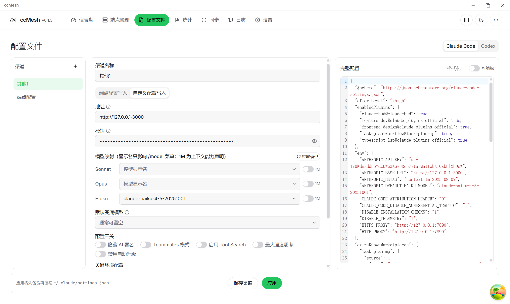
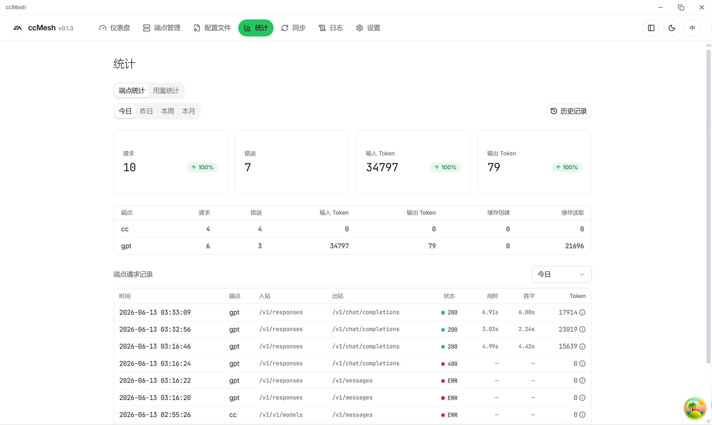
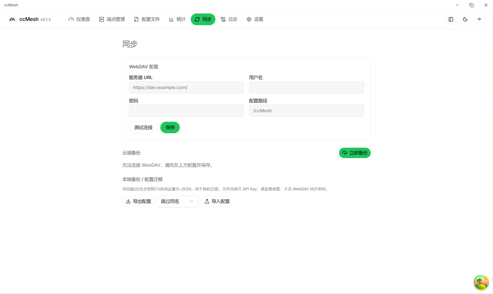
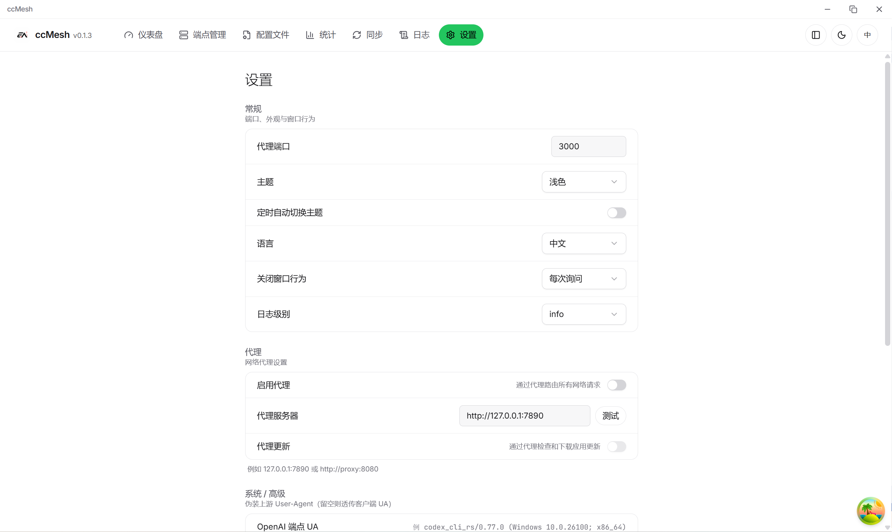
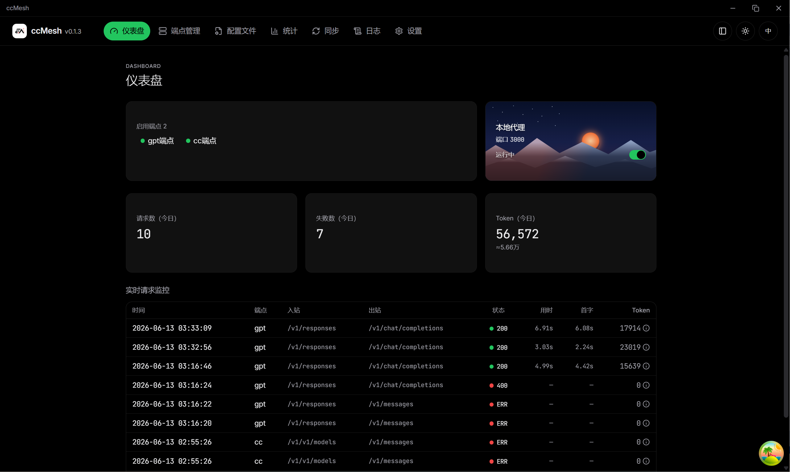

<div align="center">
  
  <h1>ccMesh</h1>

  <p><strong>轻量级跨平台 AI 代理网关桌面应用。</strong></p>

  <p>
    
    
    
  </p>

  <p>
    <a href="https://github.com/VkRainB/ccMesh">GitHub</a>
    ·
    <a href="https://github.com/VkRainB/ccMesh/releases/latest">下载</a>
    ·
    <a href="docs/guides/auto-update-and-release.md">更新与发布</a>
    ·
    <a href="README.en.md">English</a>
  </p>
</div>

---

ccMesh 是基于 **Tauri 2 + Rust + React 19** 的桌面端 AI 代理网关：在本机统一接入 Claude / OpenAI / Codex 等多类上游，提供协议转换、模型映射、端点轮换与熔断、请求统计与配置管理等能力。支持 Windows、macOS、Linux。

## 界面预览

<table>
  <tr>
    <td align="center"><br/><sub>仪表盘：代理状态、Token 概览与实时请求监控</sub></td>
    <td align="center"><br/><sub>端点管理：多端点、模型映射与连通性测试</sub></td>
  </tr>
  <tr>
    <td align="center"><br/><sub>配置文件：Claude Code / Codex 渠道化管理</sub></td>
    <td align="center"><br/><sub>统计：用量汇总与端点维度分析</sub></td>
  </tr>
  <tr>
    <td align="center"><br/><sub>同步：配置备份、恢复与导出</sub></td>
    <td align="center"><br/><sub>设置：全局代理、UA 与系统选项</sub></td>
  </tr>
  <tr>
    <td colspan="2" align="center"><br/><sub>深色主题界面</sub></td>
  </tr>
</table>

## 功能特性

### 仪表盘

- 本地代理服务启停与端口状态一览
- 今日 Token 用量与请求概览
- 实时请求监控：模型、耗时、首字延迟、Token 明细

### 端点管理

- 多端点 CRUD、拖拽排序、列表/网格视图
- 支持 **claude（直通）**、**openai（转换）**、**codex（Responses）** 三类转换器
- 模型清单维护、入站/出站模型映射、连通性测试
- 按模型过滤的轮换与熔断，避免无关端点被误伤

### 配置文件

- 以「渠道」管理 Claude Code `settings.json` 与 Codex `auth.json` + `config.toml`
- 端点写入 / 自定义写入双模式，表单与 JSON 双向联动
- 保存渠道与应用覆写分离，应用前自动备份

### 统计与同步

- 按应用、端点、模型维度查看历史用量
- 配置与数据备份、恢复、导出

### 设置

- 全局出站代理、Claude/Codex CLI User-Agent
- 应用内自动更新（GitHub Releases）

## 安装

最新安装包见 [Releases](https://github.com/VkRainB/ccMesh/releases/latest)。应用支持通过内置更新器拉取新版本（详见 [`docs/guides/auto-update-and-release.md`](docs/guides/auto-update-and-release.md)）。

### Windows

下载 `*-setup.exe`（NSIS）或 `*.msi`，双击安装即可。

### macOS（当前为未签名版本）

由于暂未配置 Apple 开发者签名与公证，首次打开可能被 Gatekeeper 拦截。推荐：

1. 将 ccMesh.app 拖入「应用程序」
2. **右键** ccMesh →「打开」→ 再次确认「打开」

若提示「已损坏」，可在终端执行：

```bash
xattr -dr com.apple.quarantine /Applications/ccMesh.app
```

### Linux

按发行版选择安装包：

- **AppImage（推荐）**

  ```bash
  chmod +x ccMesh_*.AppImage
  ./ccMesh_*.AppImage
  ```

- **deb（Debian/Ubuntu）**

  ```bash
  sudo apt install ./ccMesh_*_amd64.deb
  ```

- **rpm（Fedora/RHEL）**

  ```bash
  sudo dnf install ./ccMesh-*.x86_64.rpm
  ```

## 从源码构建

**环境要求**

- Rust stable — https://rustup.rs
- Node.js LTS、pnpm 10+
- 各平台 Tauri 构建依赖 — https://tauri.app/start/prerequisites/

**开发**

```bash
pnpm install
pnpm tauri dev      # 启动桌面开发环境
pnpm test           # 前端单测
```

**生产构建**

```bash
pnpm tauri build
```

各平台额外依赖：

- **Windows**：MSVC 工具链 + WebView2
- **macOS**：Xcode Command Line Tools（通用二进制）
- **Linux**（Ubuntu/Debian 构建机）：

  ```bash
  sudo apt-get install -y \
    libwebkit2gtk-4.1-dev \
    libayatana-appindicator3-dev \
    librsvg2-dev \
    patchelf
  ```

> 本地 `pnpm tauri build` 若开启 updater 签名产物，需配置 `TAURI_SIGNING_PRIVATE_KEY` 等环境变量，详见 [`docs/guides/auto-update-and-release.md`](docs/guides/auto-update-and-release.md)。

**检查**

```bash
pnpm check:front
pnpm check:rust
```

## 技术栈

Tauri 2、Rust、axum、reqwest（rustls）、SQLite、React 19、TypeScript、Vite、TanStack Query、Tailwind CSS v4、shadcn/ui、CodeMirror 6。

## 许可证

ccMesh 采用 [Apache License 2.0](LICENSE) 开源协议。

## Star History

<div align="center">
  <a href="https://www.star-history.com/#VkRainB/ccMesh&Date">
    <picture>
      <source media="(prefers-color-scheme: dark)" srcset="https://api.star-history.com/svg?repos=VkRainB/ccMesh&type=Date&theme=dark" />
      <source media="(prefers-color-scheme: light)" srcset="https://api.star-history.com/svg?repos=VkRainB/ccMesh&type=Date" />
      
    </picture>
  </a>
</div>
