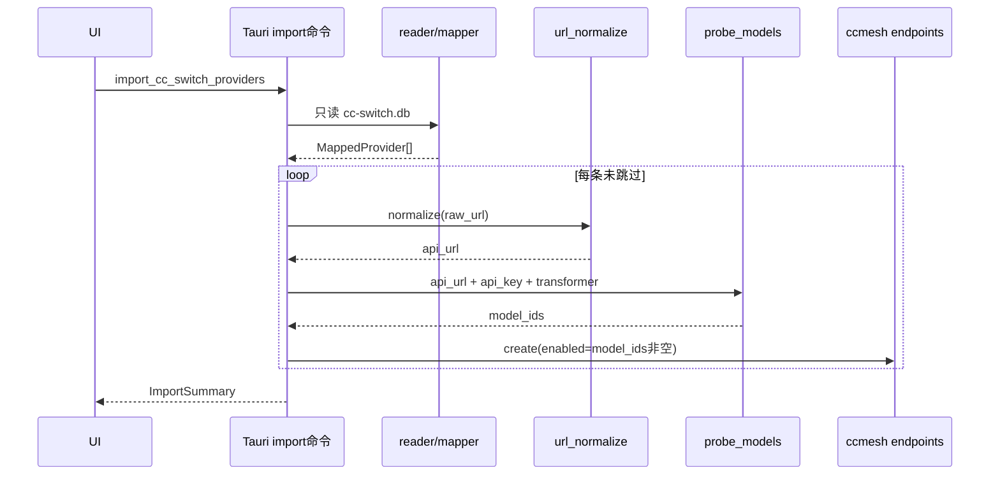

# cc-switch 供应商导入实现流程

> 前置调研：[cc-switch-field-mapping.md](./cc-switch-field-mapping.md)  
> Phase 1：`providers`（`claude` / `codex`）→ ccMesh `endpoints`  
> 更新：2026-06-26

---

## 1. 目标

从 cc-switch 只读打开 `cc-switch.db`，取出可迁移供应商，**规整 URL** 后调用已有 **`probe_models`** 拉模型；**拉到模型 → `enabled=true`**，否则 **`enabled=false`**，写入 `ccmesh.db`。

---

## 2. 建议模块

```
src-tauri/src/modules/migration/cc_switch/
├── mod.rs           # 编排入口 import_from_cc_switch
├── reader.rs        # 只读 SQLite，读 providers 行
├── mapper.rs        # 行 → MappedProvider（name/url/key/transformer/…）
├── url_normalize.rs # normalize_api_url_for_ccmesh
└── importer.rs      # 探测 + endpoint_repo::create
```

Tauri 命令（预览 / 导入分离）：

- `preview_cc_switch_import(db_path?)` → 列表 + 探测结果，**不写库**
- `import_cc_switch_providers(db_path?, ids?, overwrite?)` → 写库

---

## 3. 流程（按序执行）

```
① 定位 cc-switch.db
② 只读连接，SELECT providers WHERE app_type IN ('claude','codex')
③ 逐行 mapper：解析 settings_config + meta → MappedProvider
④ 筛查跳过（OAuth / 无 key / 占位 key）→ status=skipped
⑤ normalize_api_url(raw_url) → api_url
⑥ probe_models(client, api_url, api_key, transformer)  // 已有
⑦ 组装 CreateEndpointRequest，endpoint_repo::create
⑧ 返回 ImportSummary
```

### 3.1 ① 定位数据库

1. 参数 `db_path` 优先；否则 `get_cc_switch_db_candidates()`：
   - `%USERPROFILE%\.cc-switch\cc-switch.db`
   - Windows 额外：`%HOME%\.cc-switch\cc-switch.db`（legacy）
2. 文件不存在 → 报错，不创建空库。

### 3.2 ②③ 读取与映射

**SQL**：

```sql
SELECT id, app_type, name, settings_config, meta, notes, sort_index
FROM providers
WHERE app_type IN ('claude', 'codex')
ORDER BY sort_index, created_at, id;
```

**`mapper.rs` 输出 `MappedProvider`**（内部结构，非 DB 行）：

| 字段 | 来源 |
|------|------|
| `cc_switch_id`, `app_type`, `name` | 表列 |
| `raw_url` | claude: `env.ANTHROPIC_BASE_URL`；codex: 解析 TOML `base_url` |
| `api_key` | claude: `apiKey`→`AUTH_TOKEN`→`API_KEY`；codex: `auth.OPENAI_API_KEY`→… |
| `transformer` | `meta.apiFormat` 映射；默认 claude→`claude`，codex→`openai` |
| `models_hint` | claude: `ANTHROPIC_*_MODEL`；codex: TOML `model`/`review_model` |
| `remark` | `notes` + `[cc-switch:id=…;app=…]` |
| `sort_order` | `sort_index` ?? 0 |

**跳过（不进入 ⑤）**：见 [field-mapping §6](./cc-switch-field-mapping.md#6-cc-switch--ccmesh-映射phase-1)（`providerType` OAuth、`managed_account`、key/url 无效）。

### 3.3 ⑤ URL 预处理（写入 ccMesh 前必做）

ccMesh 约定：`api_url` 存**上游根地址**，网关转发时再拼 `/v1/messages`、`/v1/chat/completions` 等（见 `forward.rs`）。**库内不应以 `/v1` 结尾**，否则出现 `/v1/v1/...`（表单已有同类提示）。

**`normalize_api_url_for_ccmesh(raw) -> Result<String>`**：

| 步骤 | 规则 |
|------|------|
| 1 | `trim` 空白 |
| 2 | 去掉末尾 `/`（可循环直到稳定） |
| 3 | 若以 `/v1` 结尾（大小写不敏感）→ 去掉该后缀，再 trim `/` |
| 4 | 若以完整 API 路径结尾 → 剥到根（仅一层）：`/v1/messages`、`/v1/chat/completions`、`/v1/responses`、`/v1/models` |
| 5 | 结果为空或非 `http(s)://` → 该行 **skipped**（`invalid_api_url`） |

**示例**：

| cc-switch 原始 | 规整后 `api_url` |
|----------------|------------------|
| `https://api.openai.com/v1` | `https://api.openai.com` |
| `https://api.openai.com/v1/` | `https://api.openai.com` |
| `http://127.0.0.1:15721/v1` | `http://127.0.0.1:15721` |
| `https://api.deepseek.com/anthropic` | 不变 |
| `https://x.com/v1/messages` | `https://x.com` |

> 说明：`probe_models` 内部对 `/v1` 结尾有探测兼容（`models_url_from_base`），但**入库仍用规整后的 base**，与手动新建端点一致。

### 3.4 ⑥ 模型探测（复用已有实现）

**Rust 直接调**（导入在后端完成时）：

```rust
// commands/models.rs 同源逻辑
let client = build_client(want_proxy, &proxy_url, Duration::from_secs(15))?;
let model_ids = probe_models(&client, &api_url, &api_key, &transformer).await;
```

- 函数：`src-tauri/src/modules/models_probe.rs::probe_models`
- 行为：候选 URL × Claude/Bearer 鉴权，任一成功返回 `Vec<String>`，全失败返回 `[]`
- **不要**重复实现 HTTP；预览与导入共用此函数。

**前端若只做预览 UI**：可调已有命令 `fetch_endpoint_models(api_url, api_key, transformer, use_proxy)`（`endpointApi.fetchModels`）。

### 3.5 ⑦ 写入 `endpoints`

```rust
let probed = !model_ids.is_empty();

CreateEndpointRequest {
    name,
    api_url,           // 已 normalize
    api_key,
    auth_mode: "api_key".into(),
    enabled: probed,   // 核心规则：探测成功才启用
    use_proxy: false,
    transformer,
    model: pick_lock_model(&models_hint, &model_ids), // 可选：hint 在 probed 列表中则锁定
    models: model_ids.clone(),
    active_models: vec![], // 空 = 全部公布
    model_mappings: vec![],
    remark,
}
```

**探测结果附带字段**（预览 / 日志用）：

| 探测 | `enabled` | `test_status` | `models` |
|------|-----------|---------------|----------|
| `model_ids` 非空 | `true` | `available`（create 后 `update_test_status`） | 上游返回 id 列表 |
| `model_ids` 为空 | `false` | `unknown` 或 `unavailable` | `[]` 或保留 `models_hint` 仅作 remark |

推荐：**探测失败仍入库但 `enabled=false`**，用户可在端点页手动启用/改 URL；若产品要求「失败不落库」则在 `importer` 加开关。

**同名冲突**：`get_by_name` 已存在 → 跳过或 `name + " (cc-switch)"`（导入参数 `overwrite` 控制）。

### 3.6 ⑧ 返回摘要

```rust
struct ImportSummary {
    total: usize,
    imported: usize,
    skipped: usize,
    disabled_no_models: usize,  // 入库但 enabled=false
    items: Vec<ImportItem>,     // { name, status, skip_reason?, model_count, enabled }
}
```

---

## 4. 端到端时序



---

## 5. 实现检查清单

- [ ] `rusqlite` 以 `open_readonly` 打开 cc-switch.db，禁止写入
- [ ] mapper 单元测试：Claude/Codex JSON 样例（见 field-mapping §2）
- [ ] `url_normalize` 单元测试：§3.3 示例表全覆盖
- [ ] 集成测试：mock `probe_models` 或指向可丢弃的测试 key
- [ ] 日志禁止打印完整 `api_key`
- [ ] 导入完成后 `emit(Events::endpointsChanged)`（与手动 CRUD 一致）

---

## 6. 关键代码索引

| 用途 | 路径 |
|------|------|
| 字段映射 / 跳过规则 | [cc-switch-field-mapping.md](./cc-switch-field-mapping.md) |
| 模型探测 | `src-tauri/src/modules/models_probe.rs` |
| Tauri 命令（表单刷新） | `src-tauri/src/commands/models.rs::fetch_endpoint_models` |
| 端点创建 | `src-tauri/src/modules/storage/endpoint_repo.rs::create` |
| 网关 URL 拼接 | `src-tauri/src/modules/proxy/forward.rs`（`base + upstream_path`） |
| 前端 fetchModels | `src/services/modules/endpoint.ts` |
